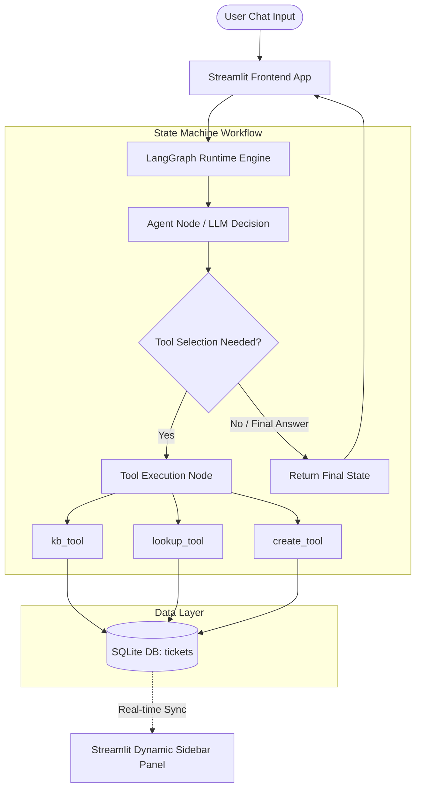

# AI Operations Assistant Using Agentic AI

An intelligent, multi-step IT Support Assistant utilizing **LangGraph** state graph routing and a persistent **SQLite database**. The assistant cleanly orchestrates task delegation between knowledge lookup tools and data modification endpoints while serving a chat interface via **Streamlit**.

## 🏗️ System Architecture



## 🛠️ Technology Stack
* **Language Framework:** Python 3.10+
* **Orchestration Matrix:** LangGraph / LangChain
* **LLM Engine:** OpenAI `gpt-4o-mini`
* **Data Storage:** SQLite Core Engine (Serverless Single-file DB)
* **User Interface:** Streamlit Engine

## 🚀 Step-by-Step Setup
1. **Clone or create** the structural directory files locally.
2. **Install all required dependencies**:
   ```bash
   pip install langchain-openai langgraph streamlit typing-extensions
   ```
3. **Configure Environment Secret**:
   ```bash
   export OPENAI_API_KEY="your-actual-api-key-here"
   ```
4. **Boot the application**:
   ```bash
   streamlit run app.py
   ```
   *Note: Running the application for the first time will automatically generate `it_support.db` and populate seed metrics.*

## 🔒 Key Design Decisions & Guardrails
* **Real-time State Refresh:** Streamlit's structural execution stack invokes `st.rerun()` directly after state loops complete to guarantee data matches mutations instantaneously without forcing mechanical manual resets.
* **Duplicate Prevention Check:** The database system queries existing tickets containing matching `Employee IDs` and structural issues before executing `INSERT` commands to enforce schema health cleanly.
